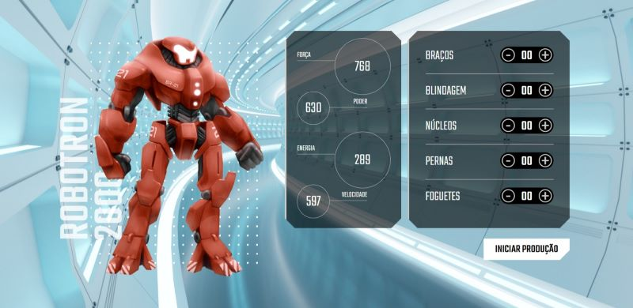

# robotron-2

Curso da Alura onde criamos uma página para interagir com o JavaScript.
Buscamos os elementos e interagimos com ele, manipulamos o evento de clique no elemento para usarmos duas funções diferentes.
